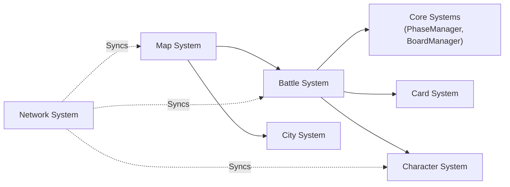

# Developer Guide - Rogue Card

## Architecture Overview

The Rogue Card project is organized into clear system modules with minimal coupling. Each system can be developed independently when interfaces are defined.



## System Descriptions

### Core Systems (`Scripts/Core/`)
- **GameEnums.cs**: All game enumerations (Phase, CardSpeed, FieldType, etc.)
- **PhaseManager.cs**: Battle phase management (Move → Battle → Setup)
- **Purpose**: Shared utilities used by all other systems

### Battle System (`Scripts/Battle/`)
- **BattleManager.cs**: Main battle orchestrator
- **BoardManager.cs**: 8x8 grid management, tile occupancy tracking
- **BattleSceneSetup.cs**: Scene initialization
- **BattleUIManager.cs**: Battle UI and phase display
- **Purpose**: Turn-based combat on isometric board

### Card System (`Scripts/Cards/`)
- **CardData.cs**: Card definitions and deck management
- **Purpose**: Card properties, deck building, card effects

### Character System (`Scripts/Characters/`)
- **Character.cs**: Character class definitions and instances
- **Purpose**: Character stats, status effects, progression

### Map System (`Scripts/Map/`)
- **MapManager.cs**: Adventure map generation and navigation
- **Purpose**: Root node selection, map progression

### City System (`Scripts/City/`)
- **CityManager.cs**: Hub functionality
- **Purpose**: Shop, healing, card exchange, quests

### Network System (`Scripts/Network/`)
- **NetworkManager.cs**: Multiplayer infrastructure
- **Purpose**: Player synchronization, server communication

## Development Workflow

### Adding a New Feature

1. **Identify Dependencies**
   - What systems does this feature depend on?
   - What interfaces do I need to implement?

2. **Define Public Interface**
   - Create abstract classes or interfaces first
   - Document the contract clearly

3. **Implement Core Logic**
   - Start with the main class
   - Implement essential methods

4. **Add Signal/Events**
   - Use Godot signals for asynchronous events
   - Allow other systems to react to changes

5. **Test Locally**
   - Create a test scene or use existing battle scene
   - Verify functionality with debug output

6. **Document & Commit**
   - Write clear comments for complex logic
   - Commit with descriptive message
   - Update relevant markdown files

### Example: Adding Card Effects

1. **Define Card Effect Interface** (Cards/ICardEffect.cs)
```csharp
public interface ICardEffect
{
    string EffectId { get; }
    void Apply(Battle.Character target);
    void Resolve(Battle.Character target);
}
```

2. **Implement Specific Effects** (Cards/Effects/)
```csharp
public class DamageEffect : ICardEffect
{
    public string EffectId => "damage_basic";
    public int Damage { get; set; }
    
    public void Apply(Battle.Character target)
    {
        // Animation/visuals
    }
    
    public void Resolve(Battle.Character target)
    {
        target.CurrentHealth -= Damage;
    }
}
```

3. **Register Effect in CardData**
```csharp
var card = new CardData
{
    EffectId = "damage_basic",
    BaseDamage = 10
};
```

4. **Execute in Battle Phase**
```csharp
// In BattleManager or card execution system
var effect = GetEffect(card.EffectId);
effect.Apply(targetCharacter);
effect.Resolve(targetCharacter);
```

## Common Patterns

### Signal Usage

Use Godot signals to decouple systems:

```csharp
[Signal]
public delegate void PhaseChangedEventHandler(BattlePhase newPhase);

public void AdvancePhase()
{
    // ... logic ...
    EmitSignal(SignalName.PhaseChanged, _currentPhase);
}

// In another script:
phaseManager.PhaseChanged += OnPhaseChanged;

private void OnPhaseChanged(BattlePhase phase)
{
    // React to phase change
}
```

### Enums for Configuration

Use enums for fixed values:

```csharp
public enum BattlePhase
{
    Move = 0,
    Battle = 1,
    Setup = 2
}

// Usage:
if (currentPhase == BattlePhase.Battle)
{
    // Handle battle phase
}
```

### Data Classes for Transfer

Create simple data classes for transferring information between systems:

```csharp
public class CardPlayData
{
    public string CardId { get; set; }
    public string PlayerId { get; set; }
    public Vector2I TargetPosition { get; set; }
}

// Usage:
BattleManager.PlayCard(new CardPlayData 
{ 
    CardId = "card_123",
    PlayerId = "player_1"
});
```

## File Organization Guidelines

### Scripts/SystemName/
- `SystemName.cs` - Main system class
- `Data.cs` or specific types
- `Manager.cs` for managers
- `Helper.cs` for utilities
- Subdirectories for large systems

### Naming Examples
```
Scripts/
  Battle/
    BattleManager.cs      # Main battle orchestrator
    BoardManager.cs       # Board logic
    BattleUIManager.cs    # UI logic
    BattleSceneSetup.cs   # Scene initialization
  Cards/
    CardData.cs           # Card definitions
    CardEffect.cs         # Effect system
    Deck.cs               # Deck management
```

## Performance Considerations

### For Battle System
- Use object pooling for frequently created objects
- Cache references to frequently accessed nodes
- Minimize allocations in _Process() methods
- Profile with Godot profiler to identify bottlenecks

### For Network System
- Batch updates when possible
- Use compression for large data transfers
- Implement client-side prediction
- Throttle frequently changing values (position, health)

## Debugging

### Console Output
Use consistent debug logging:

```csharp
GD.Print($"PhaseManager: Phase changed to {newPhase}");
GD.PrintErr("Error: Invalid phase transition");
```

### Debug Mode
Enable in BattleManager:

```csharp
[Export]
public bool DEBUG_MODE = true;  // Enables extended logging
```

### Breakpoints
- Use breakpoints in Visual Studio Code or Visual Studio
- Attach debugger to running Godot instance
- Inspect variable values in debug console

## Testing

### Unit Tests (Future)
Place in `Tests/` directory:

```csharp
[TestClass]
public class BoardManagerTests
{
    [TestMethod]
    public void TestCharacterPlacement()
    {
        // Arrange
        var board = new BoardManager();
        
        // Act
        bool result = board.PlaceCharacter(new Vector2I(0, 0), "player1");
        
        // Assert
        Assert.IsTrue(result);
    }
}
```

### Scene-based Testing
Create test scenes to verify systems:

```
Scenes/
  Tests/
    BoardTest.tscn        # Test board interactions
    PhaseTest.tscn        # Test phase transitions
```

## Common Issues and Solutions

### Circular Dependencies
**Problem**: System A depends on System B, B depends on A

**Solution**: 
- Use interfaces to break cycles
- Move common code to Core system
- Use signals for event communication

### Tight Coupling
**Problem**: Hard to develop systems independently

**Solution**:
- Define clear interfaces upfront
- Use dependency injection
- Use signals for loose coupling

### Undefined References
**Problem**: Scripts reference classes that aren't built

**Solution**:
```bash
# Rebuild .NET project
dotnet build

# In Godot:
Project → Tools → Build C# Project
```

## Integration Checklist

When integrating a new system:

- [ ] System has defined interface/contract
- [ ] System handles initialization in `_Ready()`
- [ ] System cleans up resources in `_ExitTree()`
- [ ] Signals are defined and documented
- [ ] Input handling is implemented (if needed)
- [ ] Debug output is informative
- [ ] Error cases are handled gracefully
- [ ] Code follows naming conventions
- [ ] Documentation is updated
- [ ] Changes are committed with clear message

## Resources for Developers

### Godot Concepts
- [Godot Signals](https://docs.godotengine.org/en/stable/getting_started/step_by_step/signals.html)
- [Godot Nodes](https://docs.godotengine.org/en/stable/tutorials/3d/using_3d_characters/index.html)
- [Godot C# API](https://docs.godotengine.org/en/stable/tutorials/scripting/c_sharp/index.html)

### Game Design
- Read `PROJECT_DESIGN.md` for complete game design
- Check phase descriptions in `PhaseManager.cs`
- Review card speed system documentation

### Team Communication
- Keep documentation up-to-date
- Use meaningful commit messages
- Write code comments for complex logic
- Communicate before major refactoring

## Getting Help

1. **Check existing code**: Look for similar implementations
2. **Read documentation**: PROJECT_DESIGN.md, BATTLE_SCENE_SETUP.md
3. **Ask team members**: Discuss architectural questions
4. **Prototype**: Create test scenes to experiment
5. **Debug**: Use console output and breakpoints

---

Last Updated: February 21, 2026
For questions, refer to the main README.md or PROJECT_DESIGN.md
